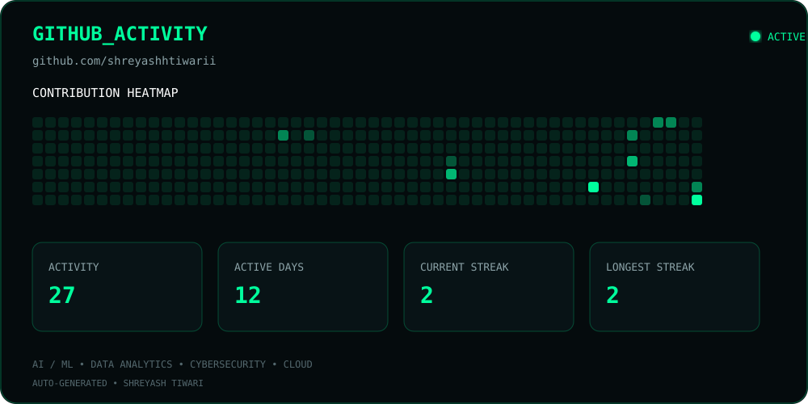

# 👋 Hi, I'm Shreyash Tiwari

### `BTech Artificial Intelligence Student` • `AI/ML Enthusiast` • `Data Analyst` • `Builder`

---

## 🖥️ `who am I`

```text
Name        : Shreyash Tiwari
Education   : BTech — Artificial Intelligence
Focus       : Artificial Intelligence & Machine Learning
Role        : Data Analyst
Interests   : Generative AI • Data Analysis
Currently   : Building practical AI-powered systems
Mindset     : Learn → Build → Experiment → Improve

```

I'm an Artificial Intelligence student and aspiring **Data Analyst** interested in building practical software that combines **AI, machine learning, data analytics, automation, and modern web technologies**.

I enjoy taking an idea from a problem statement to a working prototype — from analyzing data and designing the system to developing the backend, integrating AI, and creating an intuitive user experience.

---

## 🚀 `what I'm working on`

```text
> Exploring Artificial Intelligence & Machine Learning
> Building practical AI-powered applications
> Developing Data Analytics skills
> Working with Python, SQL & Data Visualization
> Improving Data Structures & Programming
> Participating in hackathons and technical projects

```

### 🔭 Current Project

**Spatial Cyber Threat Reconstruction Engine**

An AI-driven cybersecurity concept focused on reconstructing cyber incidents across **space and time**, helping visualize how threats evolve, identify relationships between events, and support faster investigation.

`AI/ML` `Cybersecurity` `Data Visualization` `Spatial Analysis`

---

## 📊 `data_analytics_path`

```text
> Python for Data Analysis
> SQL & Database Management
> NumPy & Pandas
> Data Cleaning & Preprocessing
> Exploratory Data Analysis
> Statistics & Probability
> Data Visualization
> Power BI & Dashboard Development
> Machine Learning for Analytics
> Business & Data-Driven Decision Making

```

### 🎯 Analytics Focus

I'm developing skills in **data cleaning, exploratory data analysis, SQL, statistics, visualization, dashboard development, and machine learning**, with the goal of turning raw data into meaningful insights and actionable decisions.

---

## 🧠 `tech_stack`

### Languages

`Python` `C` `C++` `SQL` `HTML` `CSS` `JavaScript`

### AI / Machine Learning

`Machine Learning` `NLP` `Computer Vision` `Generative AI`

### Data Analytics

`NumPy` `Pandas` `Matplotlib` `Seaborn` `Power BI` `Excel` `Statistics`

### Backend & Database

`Flask` `REST APIs` `SQLAlchemy` `PostgreSQL` `JWT`

### Development Tools

`Git` `GitHub` `VS Code` `Jupyter Notebook`


---

## 🧩 `featured_projects`

### 🛡️ Spatial Cyber Threat Reconstruction Engine

> **AI + Cybersecurity + Spatial Intelligence**

A system concept for reconstructing and visualizing cyber threats based on their **temporal and spatial relationships**.

**Focus:** Threat reconstruction • AI/ML • Event correlation • Visualization

---

### 🗳️ VoteChain

> **Decentralized E-Voting + AI Anomaly Detection**

A secure e-voting system combining authentication, anomaly detection, and a backend API architecture.

**Tech:** `Python` `Flask` `PostgreSQL` `SQLAlchemy` `JWT` `Isolation Forest`

---

### 🚦 AI Traffic Risk Heatmap

> **AI-Based Traffic Risk Analysis & Police Deployment Support**

An AI-based decision-support concept designed to identify high-risk traffic zones and help optimize police deployment using historical and contextual traffic data.

**Focus:** `Machine Learning` `Data Analysis` `Geospatial Visualization`

---

### 🎓 AI Course Consultant

> **Generative AI + Voice-Based EdTech Assistant**

A student-focused AI consultant designed to help users explore courses based on their goals, understand course information, and interact through a conversational voice interface.

**Focus:** `Generative AI` `Voice AI` `EdTech` `Recommendation Systems`

---

## 💼 `experience`

### CodeAlpha — Artificial Intelligence Intern

During my internship, I worked on practical AI applications including:

* 🌐 **Translation Tool**
* 🤖 **FAQs Chatbot**

The experience helped me strengthen my understanding of **Python, AI application development, natural language processing, problem-solving, and building practical software solutions**.

---

## 🔥 `contribution_streak`

---

## 🌐 `connect`

**LinkedIn:** [Shreyash Tiwari](https://www.linkedin.com/in/shreyash-tiwari-8525633ba)

**GitHub:** `shreyashhtiwarii`

**LeetCode:** [shreyashhtiwarii](https://leetcode.com/u/shreyashhtiwarii/)

**Email:** `shreyashtiwari371@gmail.com`

---

## GitHub Activity

<div align="center">



</div>

### `while(alive) { learn(); build(); analyze(); improve(); }`

**Thanks for visiting my profile! 🚀**
